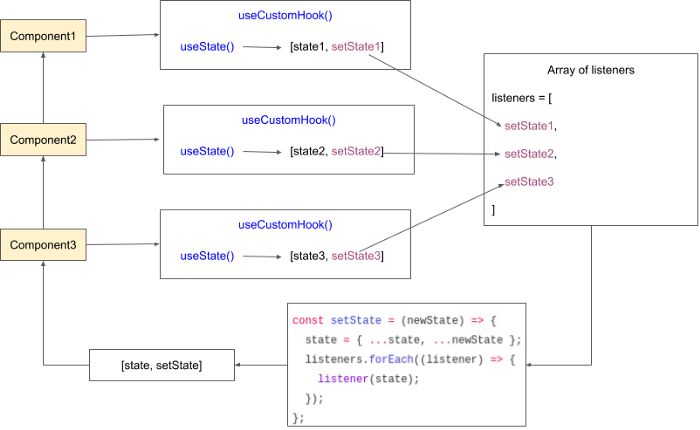

`npm i use-global-hook`
## **Ý tưởng chia sẻ states**
Chúng ta có thể thấy rằng, Hook state hoạt động giống hệt với state trong class componennt. Mỗi instance của component đều có state riêng của nó. Để chia sẻ state giữa component, chúng ta sẽ sử dụng giải pháp tạo một Custom Hook.


Ý tưởng là tạo mảng các listeners và một state object. Mỗi khi component nào đó thay đổi state, tất cả các component đã đăng ký sẽ gọi hàm setState() để cập nhật theo.

Công việc này được thực hiện bằng cách gọi useState() bên trong custom Hook của chúng ta. Tuy nhiên, thay vì trả về hàm setState(), chúng ta thêm nó vào mảng các listeners, sau đó trả về một hàm để cập nhật state object và chạy tất cả các listeners functions.

## **Tạo Custom Hook**
## **Xóa listener khi component unmounted**
```javascript
const useCustom = () => {
  const newListener = useState()[1];
  useEffect(() => {
    // Called just after component mount
    listeners.push(newListener);
    return () => {
      // Called just before the component unmount
      listeners = listeners.filter(listener => listener !== newListener);
    };
  }, []);
  return [state, setState];
};
```
- Đặt React làm tham số, để không cần phải import nữa.
- Không cần export customHook nữa. Thay vào đó, export một functions mà return về một customHook theo thông số initialState.
- Tạo một store object để lưu các giá trị state
- Sử dụng arrow function setState() và useCustom() để chúng ta có thể bind giữa store và this.  
```javascript
function setState(newState) {
  this.state = { ...this.state, ...newState };
  this.listeners.forEach((listener) => {
    listener(this.state);
  });
}
function useCustom(React) {
  const newListener = React.useState()[1];
  React.useEffect(() => {
    // Called just after component mount
    this.listeners.push(newListener);
    return () => {
      // Called just before the component unmount
      this.listeners = this.listeners.filter(listener => listener !== newListener);
    };
  }, []);
  return [this.state, this.setState];
}
const useGlobalHook = (React, initialState) => {
  const store = { state: initialState, listeners: [] };
  store.setState = setState.bind(store);
  return useCustom.bind(store, React);
};
export default useGlobalHook;
```
Bởi vì Hook mà chúng ta tạo đã tổng quát hơn lúc trước nên cần thiết lập nó trong store file, mục đích là để dễ đọc hơn.
```javascript
import React from 'react';
import useGlobalHook from './useGlobalHook';
const initialState = { counter: 0 };
const useGlobal = useGlobalHook(React, initialState);
export default useGlobal;
```
## **Tách action ra khỏi component**
Không nên  thao tác trực tiếp global state từ component.

Cách tốt nhất là tách business logic ra khỏi component bằng cách tạo các action để tương tác với global state.

Không cho phép component truy cập vào hàm setState(), chỉ có thể thêm action vào thôi.

Để làm được điều đó, chúng ta sẽ truyền action vào hàm useGlobalHook(). Có một vài điểm lưu ý:

- Action sẽ truy xuất vào store object. Do đó, các actions có thể đọc state thông qua store.state, ghi state thông qua store.setState(). Thậm chí là gọi các actions khác thông qua state.actions.  
- Về tổ chức mã nguồn, actions object có thể chứa action con.
```javascript
function setState(newState) {
  this.state = { ...this.state, ...newState };
  this.listeners.forEach((listener) => {
    listener(this.state);
  });
}
function useCustom(React) {
  const newListener = React.useState()[1];
  React.useEffect(() => {
    this.listeners.push(newListener);
    return () => {
      this.listeners = this.listeners.filter(listener => listener !== newListener);
    };
  }, []);
  return [this.state, this.actions];
}
function associateActions(store, actions) {
  const associatedActions = {};
  Object.keys(actions).forEach((key) => {
    if (typeof actions[key] === 'function') {
      associatedActions[key] = actions[key].bind(null, store);
    }
    if (typeof actions[key] === 'object') {
      associatedActions[key] = associateActions(store, actions[key]);
    }
  });
  return associatedActions;
}
const useGlobalHook = (React, initialState, actions) => {
  const store = { state: initialState, listeners: [] };
  store.setState = setState.bind(store);
  store.actions = associateActions(store, actions);
  return useCustom.bind(store, React);
};
export default useGlobalHook;
```
